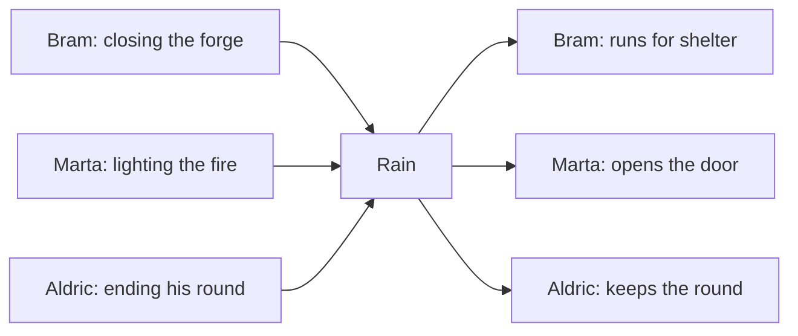
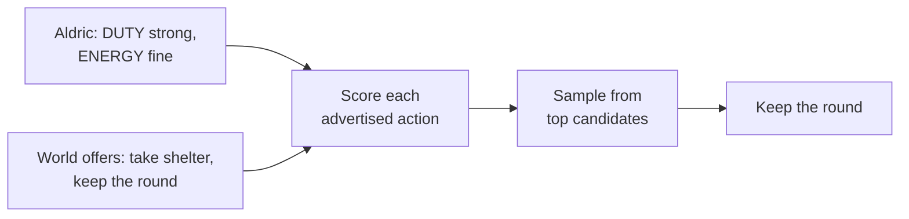

# geppetto

Dusk in a medieval village. Bram the blacksmith closes his forge. Marta the tavern keeper lights the fire. Aldric the guard ends his round. Rain begins. Bram runs for shelter. Marta opens the door — rain brings customers. Aldric keeps walking: duty outweighs comfort. Nobody wrote this scene. Three NPCs heard the same event and answered three different ways, because different needs and personalities scored the same advertisements the world made.



geppetto is the engine behind Aldric's choice: a stateless Utility AI core. The game sends each NPC's state plus the actions the nearby world advertises; geppetto scores them and returns one selected action per NPC.



## Facts

- Two consumption modes: import the Go module and decide in-process, or run the stateless gRPC subprocess — the client owns the world and sends a fresh snapshot per call; startup handshake is one JSON line on stdout.
- `BatchDecide` is the production wire path; `Decide` is the one-agent path for tuning. The served batch omits preconditions, cost, provider state, and occupants — over the wire, eligibility is reach plus an open slot. In-process, the full model applies, including `ConsiderationUpdater.Value` functions no wire format can carry.
- Deterministic within a version: same input and seed, same result; scoring is parallel, reconciliation serial. Across versions the calibration may change — pin the module version for replay.
## Use it as a library

```go
decider := geppetto.NewDecider(geppetto.WithProfile(profile))
action := decider.Decide(agent, providers, seed) // same seed, same choice
```

`NewSimulator` advances mutable NPC state tick by tick; runnable examples live in `example_test.go`.

## Author your own world

- The engine ships with no genre and no consideration built in — it reads a profile. `HUNGER` exists only because a profile says so.
- A profile is one JSON file declaring the world's considerations (id, range, weight, critical threshold, response curve, updater), the tuning knobs, and the aggregated-event table for NPCs returning from simplified to full simulation.
- [`configs/schema/profile.schema.json`](configs/schema/profile.schema.json) is the format contract; profiles carry a `$schema` key, so editors validate as you type and a bad profile fails at startup.
- The four profiles in [`configs/`](configs/) are starting points:

| Profile | What it illustrates |
|---|---|
| `social-life` | High temperature (`1.2`) and preemption margin (`1.7`): stubborn, emergent behavior. |
| `tactical-stealth` | Low temperature (`0.5`): near-optimal competence. Perception-driven `THREAT`/`COVER`, event-driven `AMMO`. |
| `survival-crafting` | Heavy weights and critical thresholds on `HUNGER`, `THIRST`, `ENERGY`. |
| `open-world-rpg` | The village above: `DUTY` against `ENERGY` and `HUNGER`, plus perception-driven `SECURITY`. |

## Run it

- `make build` — produces `bin/geppetto`
- `make test` — `go test ./...`
- `make dev` — hot reload via [Air](https://github.com/air-verse/air)
