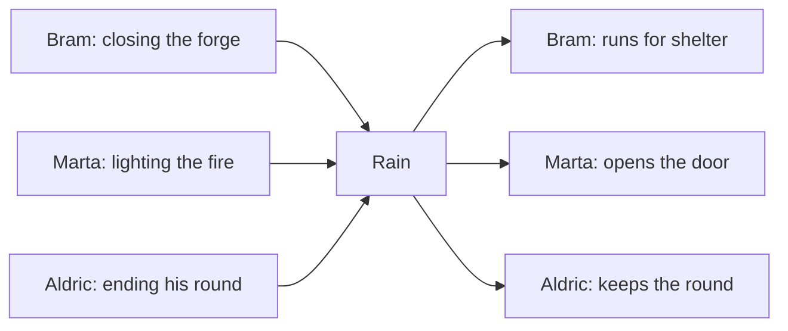
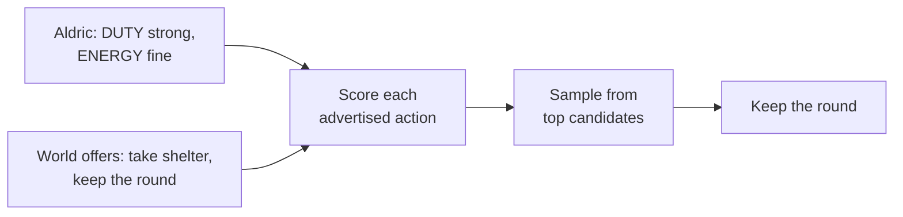

# geppetto

Dusk in a medieval village. Bram the blacksmith closes his forge. Marta the tavern keeper lights the fire. Aldric the guard ends his round. Rain begins. Bram runs for shelter. Marta opens the door — rain brings customers. Aldric keeps walking: duty outweighs comfort. Nobody wrote this scene. Three NPCs heard the same event and answered three different ways, because different needs and personalities scored the same advertisements the world made.

geppetto is the service behind Aldric's choice: a stateless Utility AI engine. The game sends each NPC's state plus the actions the nearby world advertises; geppetto scores them and returns one selected action per NPC.

## Facts

- Stateless subprocess speaking gRPC: the client owns the world and sends a fresh snapshot per call; the startup handshake is a single JSON line on stdout.
- `BatchDecide` is the production path; `Decide` is the one-agent path for tuning.
- The served batch omits action preconditions, cost, provider state, and provider occupants — over the wire, eligibility reduces to reach plus an open slot.
- Deterministic: same input and seed, same result. Scoring is parallel; contention reconciliation is serial.
- Package contracts live next to the code (`go doc ./internal/engine` and siblings).

## Author your own world

- The engine ships with no genre and no consideration built in — it reads a profile. `HUNGER` exists only because a profile says so.
- A profile is one JSON file declaring the world's considerations (id, range, base weight, critical threshold, response curve, updater), the tuning knobs, and the aggregated-event table applied when an NPC returns from simplified to full simulation.
- [`configs/schema/profile.schema.json`](configs/schema/profile.schema.json) is the format contract. Profiles carry a `$schema` key, so editors validate as you type; a profile the loader rejects fails at startup.
- The four profiles in [`configs/`](configs/) are starting points:

| Profile | What it illustrates |
|---|---|
| `social-life` | High temperature (`1.2`) and preemption margin (`1.7`): stubborn, emergent behavior from `HUNGER`, `ENERGY`, `FUN`. |
| `tactical-stealth` | Low temperature (`0.5`): near-optimal competence. Perception-driven `THREAT`/`COVER`, event-driven `AMMO`. |
| `survival-crafting` | Heavy weights and critical thresholds on `HUNGER`, `THIRST`, `ENERGY`. |
| `open-world-rpg` | The village above: `DUTY` against `ENERGY` and `HUNGER`, plus perception-driven `SECURITY`. |

## Run it

- `make build` — produces `bin/geppetto`
- `make test` — `go test ./...`
- `make dev` — hot reload via [Air](https://github.com/air-verse/air)

## Provenance

- The design was generalized from analysis of a promotional video about the AI of a life-simulation game. Nothing here claims anything about that game's real implementation.
