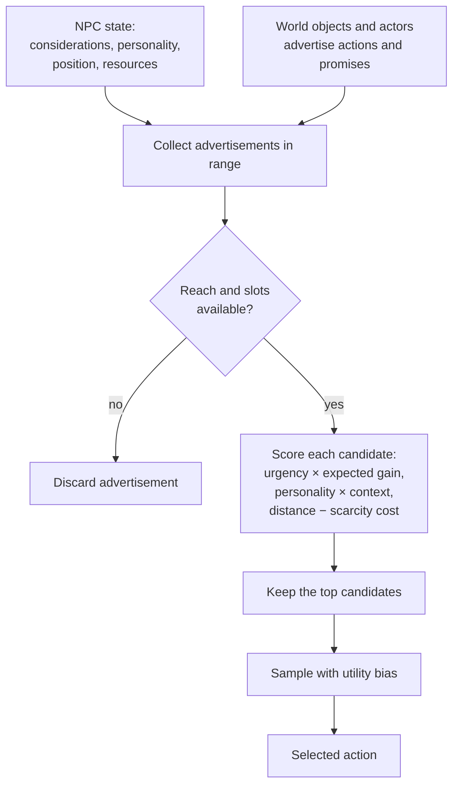
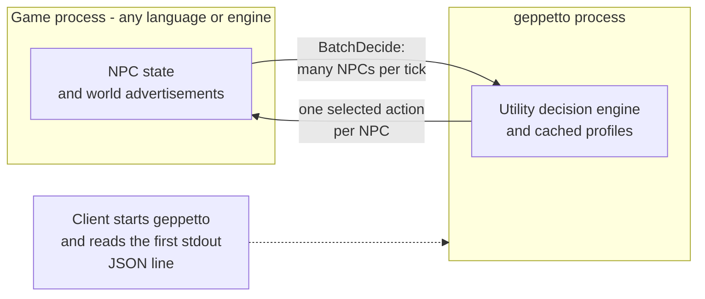

# geppetto

geppetto is a stateless Utility AI service for deciding what each NPC should do next. A game sends the current state of its agents and the affordances offered by the nearby world; geppetto returns one selected action per agent.

## The problem: scripted NPCs age badly

Traditional NPC behavior is a script: a designer writes a routine and the NPC follows it. The result is often robotic and predictable. The content cost is worse. With N NPC types and M world-object types, teaching every NPC how to use every new object grows as N × M. Adding a chair means touching the behavior of every NPC that should sit.

geppetto reverses that dependency. An object advertises what it offers — “sit here and recover comfort” — and each NPC scores the advertisements it can reach against its current needs, personality, context, distance, and resources. A new object contributes a new advertisement without changing any NPC logic: the integration surface grows closer to N + M than N × M.

The NPC is also not supposed to choose perfectly. An always-optimal agent is predictable, exploitable, and poor at generating stories. geppetto samples among the strongest candidates with a tunable bias, from a nearly infallible tactical soldier to a chaotic tavern regular. The imperfection is deliberate, but the choices remain explainable.

## How a decision works

- **Considerations** are game-defined signals such as hunger, energy, threat, ammunition, duty, or social need. Updaters change them over time, through events, or from the sensed world.
- **Affordances** are advertisements made by objects, locations, events, or other actors. Each action promises deltas to considerations and declares tags, a domain, reach, priority, and capacity.
- **Scoring** combines urgency through response curves, saturated expected gain, intrinsic priority, personality, squared context salience, distance, and scarcity-weighted cost.
- **Selection** samples from the top candidates with softmax. A batch then reconciles contested slots by physical proximity, not utility: hunger does not make anyone reach a resource faster.



The service is intentionally stateless. The client owns the world and sends a fresh snapshot with every call. `BatchDecide` is the production path; `Decide` is the one-agent path for tuning and debugging.



## The batch contract

The protobuf request uses structure-of-arrays (SoA): parallel packed arrays carry agents, positions, considerations, providers, and action data. A batch contains one `profile_id`, and consideration values follow that profile's declared order. This keeps serialization and allocation from becoming the decision budget at tens of thousands of agents per tick.

The current served batch deliberately has a narrower contract than the in-process engine model. It carries agent identity, position, and consideration values; provider identity, position, and capacity; and action identity, duration, tags, domain, priority, radius, deltas, action capacity, and action occupancy. It does **not** transport action preconditions, cost, provider state, or provider occupants. Therefore served-path eligibility reduces to reach plus provider/action slots. Clients that need capability, inventory, cost, provider-state, or occupant filtering must apply it before constructing the batch, potentially using separate batches for agents with different eligibility.

Provider capacity `0` blocks a provider. Action capacity `0` means **no action-level limit**, unlike provider capacity; this is deliberate because proto3 encodes an omitted numeric field as zero and older clients omit `action_capacities`. Positive action capacity and occupancy are enforced per provider instance, with the stricter provider/action level winning.

Batch scoring is parallel and contention reconciliation is serial and deterministic. Each agent keeps its stochastic first choice plus bounded fallbacks. When agents contend for a slot, the nearest agent wins, ties use agent ID, losers advance through their own preference lists, and exhausted agents return `selected_action_index = -1`. The same input and seed produce the same result.

## Genre instantiation

The engine does not change between genres. Change the profile's considerations, updater kinds, response curves, tuning, and the advertisements supplied by the game.

| Profile | Genre | Characteristic tuning |
|---|---|---|
| `social-life` | Life and social simulation | `SELECTION_TEMPERATURE=1.2`, `preemption_margin=1.7`, `W_PRIORITY=2`; `HUNGER`, `ENERGY`, and `FUN` favor emergent, stubborn behavior. |
| `tactical-stealth` | Tactical combat and stealth | `SELECTION_TEMPERATURE=0.5`, `preemption_margin=1.2`, `W_PRIORITY=5`; perception-driven `THREAT` and `COVER`, event-driven `AMMO`. |
| `survival-crafting` | Survival and crafting | `SELECTION_TEMPERATURE=0.8`, strong hunger/thirst weights and critical thresholds; `HUNGER`, `THIRST`, and `ENERGY`. |
| `open-world-rpg` | Village NPCs in an open world | `SELECTION_TEMPERATURE=1.2`, `preemption_margin=1.7`, `W_PRIORITY=2`; `ENERGY`, `HUNGER`, `DUTY`, and perception-driven `SECURITY`. |

The profiles are intentionally minimal examples. A production game can add hygiene, relationships, morale, injury, weather, faction goals, or narrative commitments without changing the scoring machinery. The client supplies the world-side affordances: furniture and social events, cover and flanking positions, resources and crafting stations, or jobs, shops, festivals, and threats.

## Provenance and scope

The architecture was generalized from analysis of an approximately fifteen-minute Brazilian Portuguese promotional video about the AI of a life-simulation game. That source suggested needs, object advertisements, personality, deliberate randomness, and two levels of simulation. The geppetto model turns those ideas into a genre-neutral Utility AI design.

Nothing in this repository claims that the implementation, parameters, formulas, or architecture of the game or studio that inspired the analysis are being reproduced. The profiles, equations, defaults, transport, and batch protocol are geppetto engineering decisions and describe this implementation only.

The detailed package contracts live next to the code and can be rendered with `go doc ./internal/engine`, `go doc ./internal/server`, `go doc ./internal/transport`, `go doc ./cmd/geppetto`, `go doc ./internal/config`, and `go doc ./internal/logging`.

## Operational guide

Requirements: Go and [Buf](https://buf.build). Air is optional and used only for development hot reload.

```sh
make generate       # regenerate Go protobuf code with Buf
make build          # bin/geppetto
make test           # go test ./...
make bench          # engine and server benchmarks
make lint           # buf lint and golangci-lint
make build-all      # linux/amd64, darwin/arm64, windows/amd64
go run ./cmd/geppetto --config-dir configs
```

By default, Unix systems use a Unix domain socket and Windows uses a named pipe. For development TCP, use an ephemeral port:

```sh
go run ./cmd/geppetto --transport=tcp --port=0 --config-dir configs
```

The command writes exactly one startup handshake line as JSON to stdout; structured logs go to stderr. The client must read that line before connecting. Profiles are loaded once at startup, so editing a profile takes effect after a restart.

For hot reload, install [Air](https://github.com/air-verse/air) and run:

```sh
go install github.com/air-verse/air@latest
make dev
```

The development configuration uses `tmp/geppetto-dev.sock`, a stable local address, and console/debug logs. Air watches Go files and `configs/*.json`, while generated code and test files are excluded. The stable address avoids rediscovering a new endpoint after each rebuild, but it does not preserve a connection: the old process dies, so the client must reconnect to the same address after every reload. A fixed TCP port has the same behavior.

`make build-all` produces these cross-compiled binaries:

```text
bin/geppetto-linux-amd64
bin/geppetto-darwin-arm64
bin/geppetto-windows-amd64.exe
```
