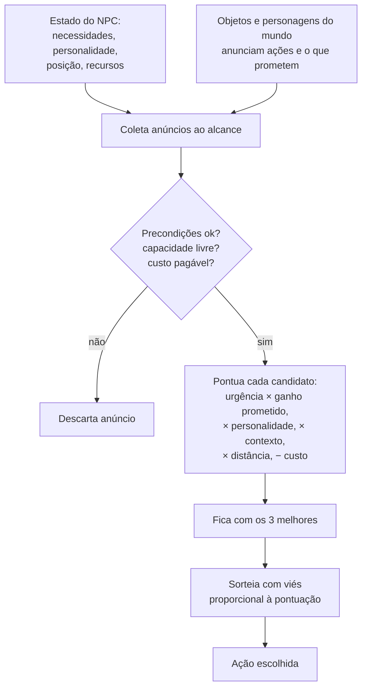
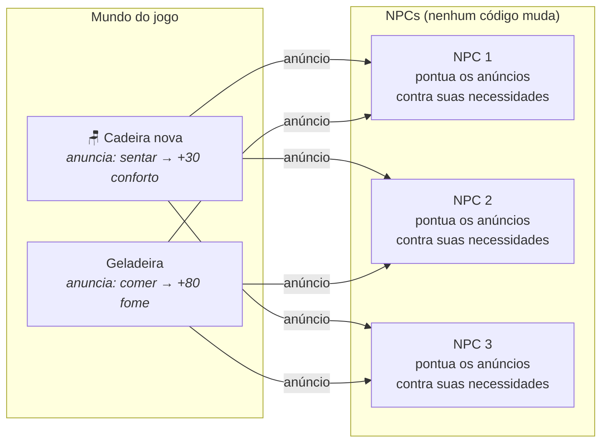
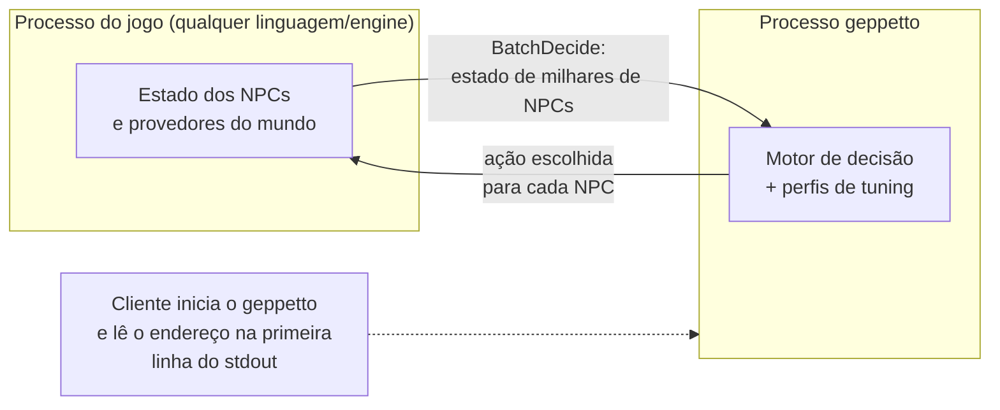

# geppetto

O geppetto decide o que cada NPC do seu jogo faz em seguida: recebe o estado dos personagens e o que o mundo ao redor oferece, e devolve uma ação escolhida para cada um.

## O problema: NPC roteirizado envelhece mal

NPC tradicional é script: o designer escreve a rotina, o NPC executa. Fica robótico e previsível.

Pior é o custo. Cada objeto novo no mundo exige tocar no script de **cada** NPC que deveria usá-lo: com N tipos de NPC e M tipos de objeto, o trabalho cresce como N × M. Adicionar uma cadeira significa ensinar cada NPC a sentar.

O geppetto inverte isso: **o objeto anuncia o que oferece** ("aqui você senta e recupera conforto"), e cada NPC **pontua os anúncios ao alcance contra o que precisa agora**. Objeto novo = um anúncio novo, zero mudança em NPC. N × M vira N + M.

E um ponto contraintuitivo: o NPC **não deve** acertar sempre. NPC perfeito é chato, não gera história e é explorável. O geppetto sorteia entre as melhores opções, com viés para as mais bem pontuadas — erro deliberado e sintonizável, do guarda quase infalível ao taverneiro caótico.

## Como funciona

- **Necessidades**: sinais como fome, energia, ameaça, munição (o jogo define quais), que mudam com o tempo e com o mundo.
- **Anúncios**: cada objeto, local ou personagem declara o que oferece, quanto aquilo promete melhorar cada necessidade e para quem vale (a porta trancada só anuncia "arrombar" para quem sabe arrombar).
- **Decisão**: o NPC pontua os anúncios elegíveis — urgência × ganho prometido, enviesado por personalidade, contexto, distância e custo — e sorteia um dos mais bem pontuados.



### Exemplo completo: uma decisão de verdade

Um NPC está com **fome em -70** (escala de -100, colapso, a +100, saciado) e **diversão em -10**. Ao alcance, dois anúncios: a **geladeira** oferece `comer` (+80 de fome); a **estante** oferece `ler` (+60 de diversão).

Necessidade não pesa de forma linear: quanto mais perto do fundo, mais ela grita. Com a curva padrão do motor, a fome a -70 gera pressão ~2,2; a diversão a -10, ~0,3. Pressão × ganho prometido:

- `comer`: 2,2 × 80 ≈ **173**
- `ler`: 0,3 × 60 ≈ **18**

Mesma distância, sem custo: `comer` vence com folga. Ninguém escreveu "se com fome, procure geladeira" — a geladeira anunciou, a fome gritou, a conta fechou.

Depois de comer, a pressão da fome desaba (promessa além do teto não vale) e `ler` passa a mandar. Com o traço `erudito`, que multiplica leitura, `ler` pode vencer **mesmo com fome razoável**. E quando duas opções empatam, o sorteio vira cara-ou-coroa enviesado — é daí que vem a variedade.

### Por que adicionar objeto não exige mexer em NPC



## E se dois NPCs escolherem a mesma coisa?

Não acontece. O serviço garante que um lote nunca devolve mais agentes para um provedor do que ele tem vagas (capacidade menos os ocupantes informados pelo cliente). O limite vale em dois níveis: vaga no provedor **e** vaga na ação — uma bancada pode aceitar 4 martelando e só 1 serrando. A pontuação continua paralela; depois dela, uma reconciliação serial distribui as vagas disputadas **aos agentes mais próximos** — quem alcança o recurso antes fica com ele. O critério é físico, não de mérito: fome não acelera ninguém.

Quem perde a disputa recebe a próxima opção da própria lista de preferência, o que pode desalojar outro NPC mais distante — a reconciliação repete até estabilizar. Se esgotar as opções, o agente sai com `selected_action_index = -1` (sem `action_id` nem `provider_id`) e o ócio é decisão do jogo. A atribuição é determinística (mesma entrada + mesma seed = mesma decisão) e stateless: a arbitragem acontece dentro da chamada, nada fica guardado entre requisições.

## Por que um processo separado

O geppetto é um processo próprio, iniciado pelo jogo como subprocesso, falando gRPC (socket Unix, named pipe no Windows, TCP em dev). Stateless: o estado de cada NPC viaja no payload.



- **A engine pode ser qualquer uma**: o contrato é gRPC; o jogo nunca linka código Go.
- **Comportamento muda sem recompilar o jogo**: tuning vive no serviço — editar configuração e reiniciar o subprocesso basta.
- **Escala**: decisões vão em lote (`BatchDecide`), com payload de arrays paralelos pensado para dezenas de milhares de agentes por tick (ver [docs/scaling.md](docs/scaling.md)).

## Onde isso serve

A mesma maquinaria atende gêneros diferentes; muda a configuração, não o motor. Quatro perfis prontos em `configs/`:

| Perfil | Gênero | Ajuste principal |
|---|---|---|
| `social-life` | Vida / simulação social | Aleatoriedade alta — máxima emergência de histórias |
| `tactical-stealth` | Combate tático / furtividade | Aleatoriedade baixa; a imperfeição migra para a percepção |
| `survival-crafting` | Sobrevivência / crafting | Limiares críticos agressivos; escassez pesa caro |
| `open-world-rpg` | NPC de vila em mundo aberto | Maioria em simulação simplificada, "acorda" perto do jogador |

## Comece por aqui

Requer Go e [Buf](https://buf.build/docs/installation/).

```sh
make generate
go test ./...
go run ./cmd/geppetto --config-dir configs
```

O processo publica o endereço de conexão em uma linha JSON no stdout; o cliente lê essa linha antes de conectar. Depois:

1. Veja um perfil em `configs/` (ex.: `social-life.json`) — há um JSON Schema em `configs/schema/` para validar enquanto edita.
2. Chame `Decide` com um agente para depurar; use `BatchDecide` em produção.
3. Hot reload: `go install github.com/air-verse/air@latest` e `make dev`.

## Detalhes técnicos

- [docs/protocol.md](docs/protocol.md) — contrato de wire: transporte, handshake, schema gRPC, formato do batch e a renomeação `npcai.v1` → `geppetto.v1`.
- [docs/development.md](docs/development.md) — build, Makefile, hot reload com air, geração de código e CI.
- [docs/scaling.md](docs/scaling.md) — payload SoA (e o que acontece a 50k agentes se simplificar), benchmarks, níveis de simulação e memória compartilhada.
